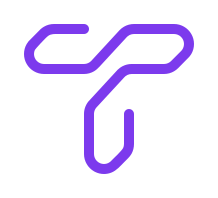

<div align="center">



<br>

<a href="https://badge.fury.io/py/trackers"></a> <a href="https://github.com/roboflow/trackers/blob/main/LICENSE.md"></a> <a href="https://badge.fury.io/py/trackers"></a>

<br>

<a href="https://colab.research.google.com/drive/1VT_FYIe3kborhWrfKKBqqfR0EjQeQNiO?usp=sharing"></a> <a href="https://discord.gg/GbfgXGJ8Bk"></a>

</div>

`trackers` is a unified library offering clean room re-implementations of leading multi-object tracking algorithms. Its modular design allows you to easily swap trackers and integrate them with object detectors from various libraries like `inference`, `ultralytics`, or `transformers`.

<div align="center">
  <table>
    <thead>
      <tr>
        <th>Tracker</th>
        <th>Paper</th>
        <th>MOTA</th>
        <th>Year</th>
        <th>Status</th>
        <th>Colab</th>
      </tr>
    </thead>
    <tbody>
      <tr>
        <td>SORT</td>
        <td><a href="https://arxiv.org/abs/1602.00763"></a></td>
        <td>74.6</td>
        <td>2016</td>
        <td>✅</td>
        <td><a href="https://colab.research.google.com/github/roboflow-ai/notebooks/blob/main/notebooks/how-to-track-objects-with-sort-tracker.ipynb"></a></td>
      </tr>
      <tr>
        <td>DeepSORT</td>
        <td><a href="https://arxiv.org/abs/1703.07402"></a></td>
        <td>75.4</td>
        <td>2017</td>
        <td>✅</td>
        <td><a href="https://colab.research.google.com/github/roboflow-ai/notebooks/blob/main/notebooks/how-to-track-objects-with-deepsort-tracker.ipynb"></a></td>
      </tr>
      <tr>
        <td>ByteTrack</td>
        <td><a href="https://arxiv.org/abs/2110.06864"></a></td>
        <td>77.8</td>
        <td>2021</td>
        <td>🚧</td>
        <td>🚧</td>
      </tr>
      <tr>
        <td>OC-SORT</td>
        <td><a href="https://arxiv.org/abs/2203.14360"></a></td>
        <td>75.9</td>
        <td>2022</td>
        <td>🚧</td>
        <td>🚧</td>
      </tr>
      <tr>
        <td>BoT-SORT</td>
        <td><a href="https://arxiv.org/abs/2206.14651"></a></td>
        <td>77.8</td>
        <td>2022</td>
        <td>🚧</td>
        <td>🚧</td>
      </tr>
    </tbody>
  </table>
</div>

# Installation

You can install `trackers` in a [**Python>=3.9**](https://www.python.org/) environment.

!!! example "Basic Installation"

    === "pip"
        ```bash
        pip install trackers
        ```

    === "poetry"
        ```bash
        poetry add trackers
        ```

    === "uv"
        ```bash
        uv pip install trackers
        ```

!!! example "Hardware Acceleration"

    === "CPU"
        ```bash
        pip install "trackers[cpu]"
        ```

    === "CUDA 11.8"
        ```bash
        pip install "trackers[cu118]"
        ```

    === "CUDA 12.4"
        ```bash
        pip install "trackers[cu124]"
        ```

    === "CUDA 12.6"
        ```bash
        pip install "trackers[cu126]"
        ```

    === "ROCm 6.1"
        ```bash
        pip install "trackers[rocm61]"
        ```

    === "ROCm 6.2.4"
        ```bash
        pip install "trackers[rocm624]"
        ```

# Quickstart

With a modular design, `trackers` lets you combine object detectors from different libraries with the tracker of your choice. Here's how you can use `SORTTracker` with various detectors:

=== "inference"

    ```python hl_lines="2 5 12"
    import supervision as sv
    from trackers import SORTTracker
    from inference import get_model

    tracker = SORTTracker()
    model = get_model(model_id="yolov11m-640")
    annotator = sv.LabelAnnotator(text_position=sv.Position.CENTER)

    def callback(frame, _):
        result = model.infer(frame)[0]
        detections = sv.Detections.from_inference(result)
        detections = tracker.update(detections)
        return annotator.annotate(frame, detections, labels=detections.tracker_id)

    sv.process_video(
        source_path="input.mp4",
        target_path="output.mp4",
        callback=callback,
    )
    ```

=== "rf-detr"

    ```python hl_lines="2 5 11"
    import supervision as sv
    from trackers import SORTTracker
    from rfdetr import RFDETRBase

    tracker = SORTTracker()
    model = RFDETRBase()
    annotator = sv.LabelAnnotator(text_position=sv.Position.CENTER)

    def callback(frame, _):
        detections = model.predict(frame)
        detections = tracker.update(detections)
        return annotator.annotate(frame, detections, labels=detections.tracker_id)

    sv.process_video(
        source_path="input.mp4",
        target_path="output.mp4",
        callback=callback,
    )
    ```

=== "ultralytics"

    ```python hl_lines="2 5 12"
    import supervision as sv
    from trackers import SORTTracker
    from ultralytics import YOLO

    tracker = SORTTracker()
    model = YOLO("yolo11m.pt")
    annotator = sv.LabelAnnotator(text_position=sv.Position.CENTER)

    def callback(frame, _):
        result = model(frame)[0]
        detections = sv.Detections.from_ultralytics(result)
        detections = tracker.update(detections)
        return annotator.annotate(frame, detections, labels=detections.tracker_id)

    sv.process_video(
        source_path="input.mp4",
        target_path="output.mp4",
        callback=callback,
    )
    ```

=== "transformers"

    ```python hl_lines="3 6 28"
    import torch
    import supervision as sv
    from trackers import SORTTracker
    from transformers import RTDetrV2ForObjectDetection, RTDetrImageProcessor

    tracker = SORTTracker()
    processor = RTDetrImageProcessor.from_pretrained("PekingU/rtdetr_v2_r18vd")
    model = RTDetrV2ForObjectDetection.from_pretrained("PekingU/rtdetr_v2_r18vd")
    annotator = sv.LabelAnnotator(text_position=sv.Position.CENTER)

    def callback(frame, _):
        inputs = processor(images=frame, return_tensors="pt")
        with torch.no_grad():
            outputs = model(**inputs)

        h, w, _ = frame.shape
        results = processor.post_process_object_detection(
            outputs,
            target_sizes=torch.tensor([(h, w)]),
            threshold=0.5
        )[0]

        detections = sv.Detections.from_transformers(
            transformers_results=results,
            id2label=model.config.id2label
        )

        detections = tracker.update(detections)
        return annotator.annotate(frame, detections, labels=detections.tracker_id)

    sv.process_video(
        source_path="input.mp4",
        target_path="output.mp4",
        callback=callback,
    )
    ```
